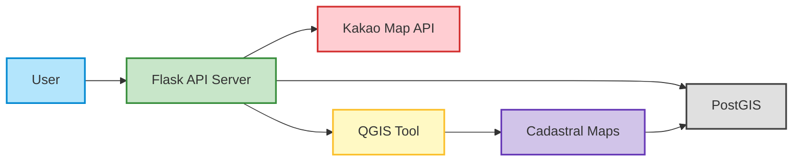

### 일제강점기 시대의 서울 영등포 당산리 연속지적원도 정보 API 제작

#### Research/  
> OpenCV를 이용하여 지적원도를 자동으로 매칭하기 위해 연구한 폴더입니다.

#### Server/
> Flask 기반의 애플리케이션으로, 지리적 좌표를 기반으로 현재 및 과거 주소 정보를 조회할 수 있는 여러 API들을 제공합니다.  
> AWS를 이용하여 API를 배포하였기 때문에, [https://cadastral-map-api.store/](https://cadastral-map-api.store/)에서 테스트해 보실 수 있습니다.   

#### 시스템 구성도
